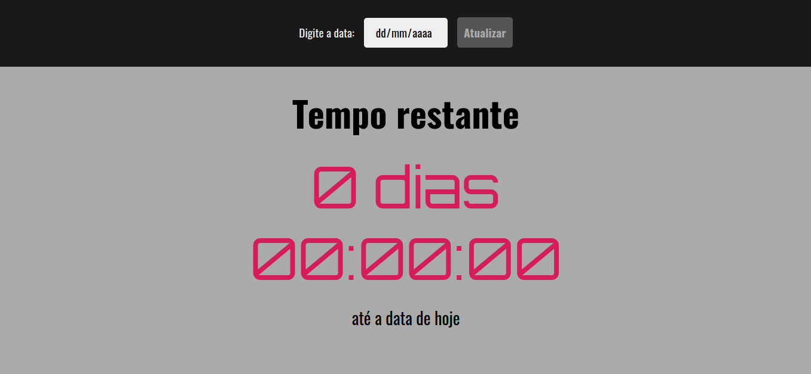
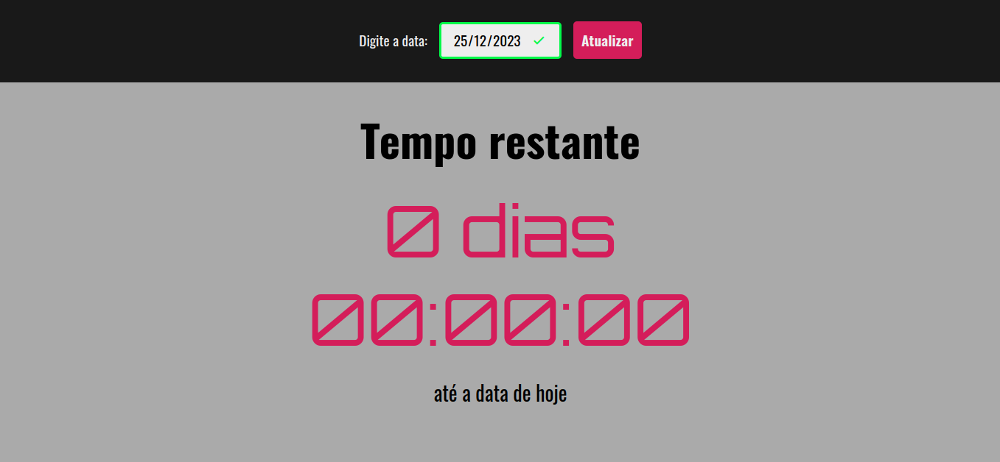
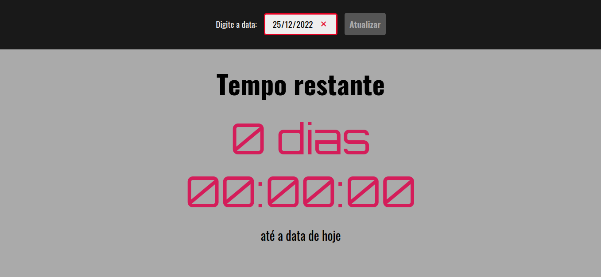
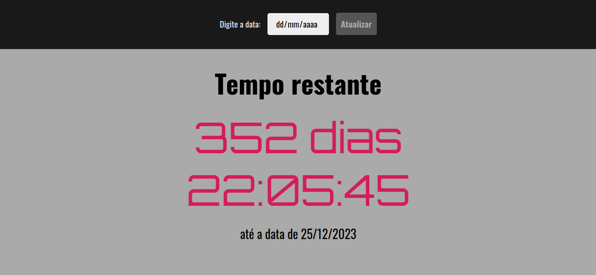

# Countdown Timer

That countdown timer helps user to know how much time remaining until to specific date.

## 🛠️ Built With

- 
- 
- 

## 👣 Step by Step

### Step 1

Access the app by the link: [Countdown Timer](https://flaviosp15.github.io/countdown-timer/)

### Step 2

The user gotta insert a valid date in input to enable the Refresh button.

**PS**: If the user insert an invalid date, the Refresh button keep disable.

### Step 3

When the Refresh button is enabled, click on it and the countdown starts.

## 🧠 Takeaways

- SetInterval
- API Date
- Validating user input
- Transition effect
